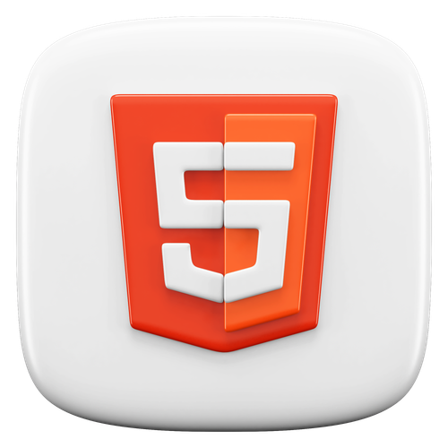
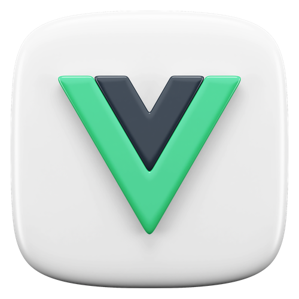
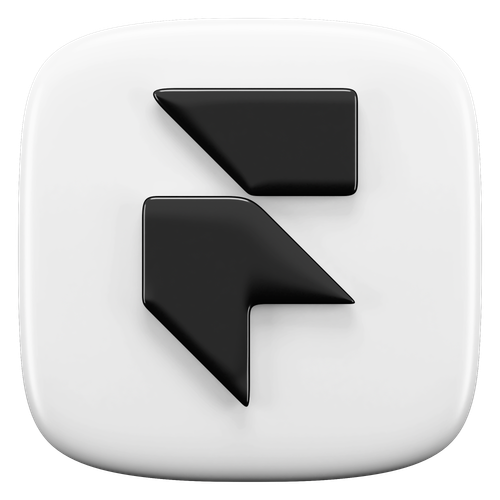

# Hi, I'm Niraj Kumar 👋

### A passionate indie developer and open sourceror building modern and creative web apps.

## 🚀 Skills

### Languages

  
  
  
  

### 🍱 Frameworks & Libraries

  
  
  
  
  

### 💻 Tools

 
  
  
  
  
  
  

---

## 🔗 Connect with me

---

## 📂 Projects

- **Coming Soon** – Short description. [Repo Link](#)
- **Coming Soon** – Short description. [Repo Link](#)
- **Coming Soon** – Short description. [Repo Link](#)

---

> “Keep it simple, clean, and modern.”
